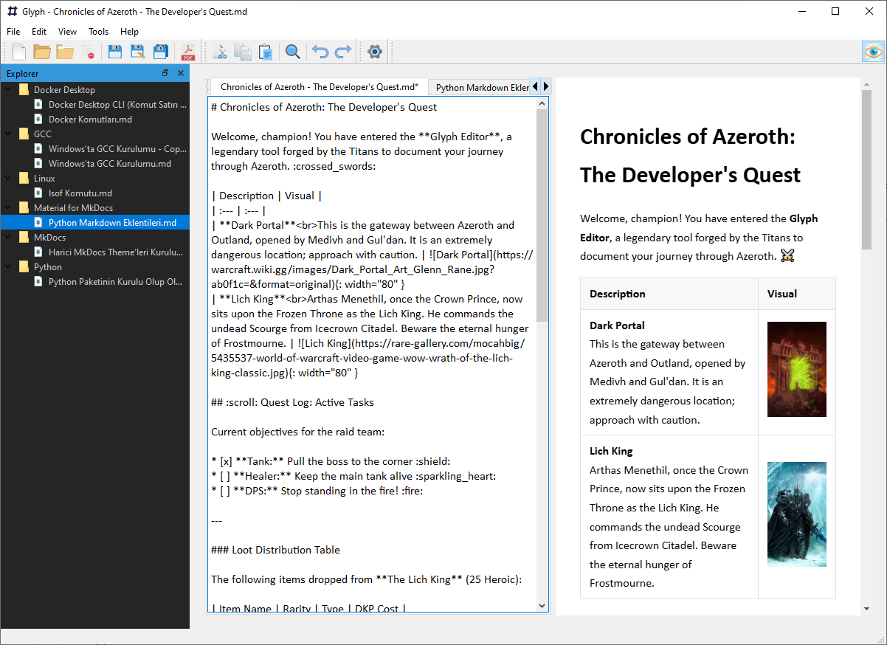

# Glyph

[](https://www.google.com/search?q=https://github.com/berkacunas/Glyph/actions/workflows/release.yml)
[](https://www.gnu.org/licenses/gpl-3.0)
[](https://www.google.com/search?q=https://github.com/berkacunas/Glyph/releases)

A modern, multi-tab Markdown editor built with PySide6, featuring a live preview powered by `QWebEngineView`.

This project was developed to provide a robust, fast, and offline-first writing tool that supports advanced Markdown extensions.



-----

## 🧭 Features

"Glyph" is more than a standard text editor; it is designed for modern Markdown workflows with a rich feature set:

  * **Live Preview:** A toggleable (`Ctrl+Shift+V`) side-by-side preview panel, powered by Chromium, that updates as you type.
  * **Multi-Tab Interface:** Open and manage multiple documents simultaneously, just like a modern code editor.
  * **Advanced Markdown Support:** Powered by `python-markdown` and `Pymdown` extensions:
      * **GitHub Emojis:** Renders shortcodes like `:rocket:` and `:smile:` as 🚀 and 😄.
      * **Admonitions (Callouts):** Create special note boxes with `!!! note "Title"` or `!!! warning`.
      * **Code Syntax Highlighting:** Syntax highlighting for code blocks via `Pygments`.
      * **Other Extensions:** Includes support for Tables, Footnotes, and Table of Contents (`[TOC]`).
  * **File Management:**
      * VS Code-style toggleable `QDockWidget` file explorer.
      * `Save All` and `Close All` actions for efficient tab management.
  * **Export Options:**
      * Export to PDF.
      * `Export As...` to various formats, including Raw HTML/XHTML, Plain Text (.txt), or clean Markdown (.md).
      * `Send...` (Send content via the default email client).
  * **Customization:**
      * A persistent settings panel using `QSettings` to remember your preferences.
      * **Font Selection** for both the editor and the preview panel.
      * Language support (TR/EN).
      * All preview styles are managed and customizable via an external `main.css` file.

-----

## 🚀 Installation & Running

To run this project from the source code:

1.  Clone the repository:

    ```bash
    git clone https://github.com/berkacunas/Glyph.git
    cd Glyph
    ```

2.  Create and activate a virtual environment:

    ```bash
    python -m venv .venv
    # On Windows:
    .\.venv\Scripts\activate
    # On macOS/Linux:
    # source .venv/bin/activate
    ```

3.  Install the required dependencies:

    ```bash
    pip install -r requirements.txt
    ```

4.  Run the program:

    ```bash
    python program.py
    ```

-----

## 👨‍💻 For Developers (Contributing)

This project follows professional CI/CD (Continuous Integration / Continuous Deployment) and Quality Assurance standards.

  * **Commit Standard:** All commit messages must adhere to the [Conventional Commits](https://www.conventionalcommits.org/) (`feat:`, `fix:`, `chore:`) standard.
  * **Commit Hooks:** The project uses `husky` and `commitlint` to enforce this standard locally before every commit.
  * **Testing:** All commits must pass the `pytest` test suite, which is hooked to the `pre-commit` script.
  * **Versioning:** Releases and the `CHANGELOG.md` file are automatically managed by `semantic-release` on the `main` branch.

To contribute, please branch from `main` and submit a Pull Request.

-----

## ⚖️ License

Glyph is free and open-source software licensed under the **GNU General Public License v3.0 (GPL-3.0)**. You are free to use, modify, and distribute this software in compliance with the license. See the `LICENSE` file for details.

---

## ❤️ Support the Project

Glyph is developed and maintained by an independent developer. If you find this tool useful and want to support its continued development (or simply want to say thanks for the pre-built `.exe`), please consider making a donation!

* [**GitHub Sponsors**](https://github.com/sponsors/berkacunas) (Coming Soon)

<a href="https://www.buymeacoffee.com/depones" target="_blank"></a>

* **Star this repo!** ⭐ It helps visibility.